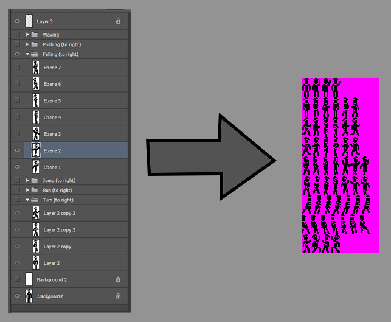
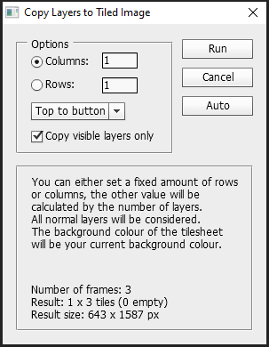

# Create Tilesheet from Layers...
Convert layers to into a tilesheet-style image by copying each layer onto its own slot in a single image.  
Can filter by visible layers and select the order of layers as well as dimensions of the resulting image.  
Very useful for sprite-based games.  
Also useful to turn a gif image into a tilesheet (photoshop can open gifs with each frame as its own layer).

NOTE: The script uses the marquee tool, which is very slow from the scripting API. So it might take a while.

## Installation
- Download .jsx file
- Copy to (PHOTOSHOP INSTALL PATH)\Presets\Scripts (e.g. "C:\Program Files\Adobe\Adobe Photoshop CS6 (64 Bit)\Presets\Scripts")
- Restart Photoshop
- The script should be available under File > Scripts > Create Tilesheet From Layers...

## Screenshots

